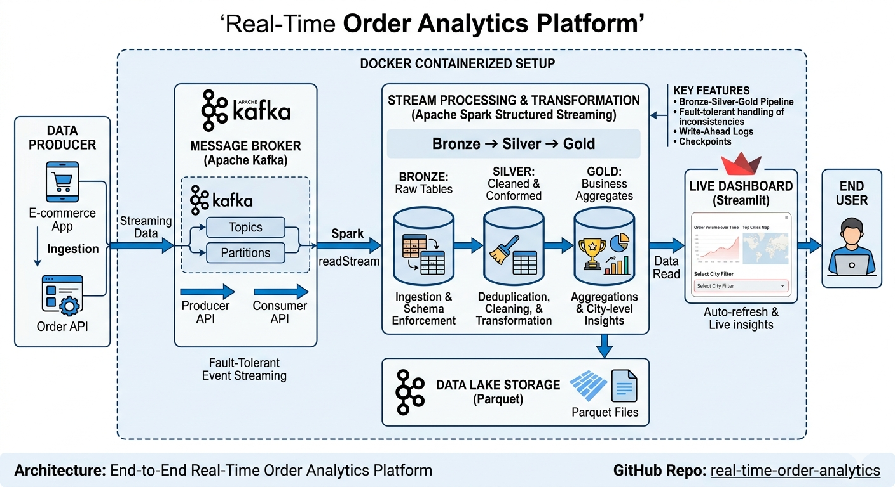
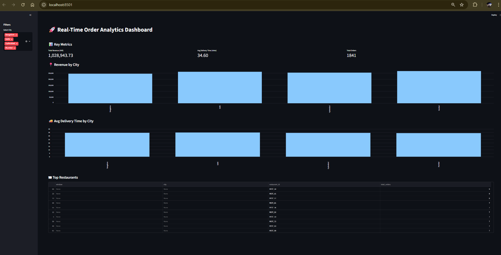
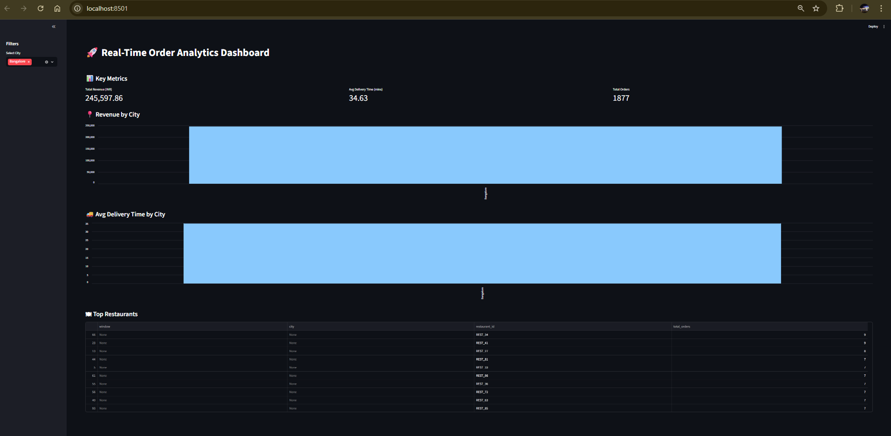
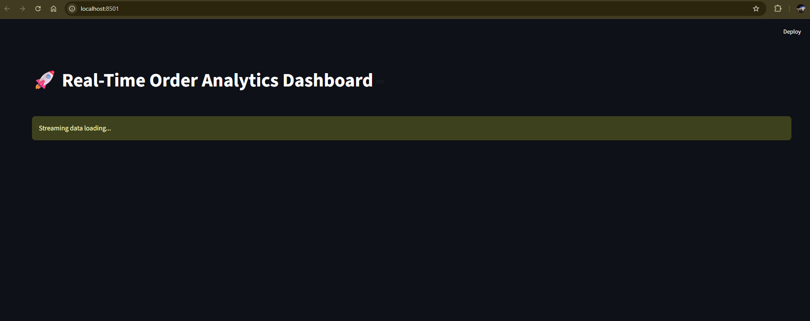

# 🚀 Real-Time Order Analytics Platform

An end-to-end real-time data engineering project that processes streaming order data and visualizes insights in a live dashboard.

---

## 🏗️ Architecture

Producer → Kafka → Spark Structured Streaming → Parquet → Streamlit Dashboard

----

## ⚙️ Tech Stack

- Apache Kafka (event streaming)
- Apache Spark Structured Streaming
- Docker (containerized setup)
- Parquet (data lake storage)
- Streamlit (real-time dashboard)

---

## 🔥 Features

- Real-time order ingestion using Kafka
- Streaming data processing with Spark
- Bronze → Silver → Gold transformation pipeline
- Live dashboard with auto-refresh
- Interactive filters (city-level insights)
- Fault-tolerant handling of streaming data inconsistencies

---

## 🧠 Key Learnings

- Designed a real-time data pipeline with low latency
- Handled race conditions between streaming writes and dashboard reads
- Managed Kafka networking in Docker environments
- Implemented structured streaming with checkpointing

---

## Challenges
### ⚙️ Spark Deployment Challenges (Windows vs Docker)
Initially, I attempted to run Apache Spark on a local Windows environment. However, this led to repeated Hadoop filesystem compatibility issues and instability.  
To resolve this, I transitioned to a Docker-based setup running Spark on Linux, which provided a more stable and production-aligned environment.

---

### 🔄 From Batch to True Streaming Pipeline
The initial design consisted of separate scripts for Bronze, Silver, and Gold layers, which behaved like batch processing pipelines.  
To enable real-time processing, I refactored the architecture into a single unified Spark Structured Streaming job. This allowed continuous data ingestion and transformation with lower latency, while maintaining the layered logic within one pipeline.

---

### ⚠️ Handling Real-Time Data Inconsistencies
While building the Streamlit dashboard, I encountered race conditions between Spark writing Parquet files and the dashboard reading them.  
This resulted in intermittent errors such as empty files or missing columns. I implemented fault-tolerant reads and validation checks to ensure dashboard stability.

---

### 🔌 Kafka & Docker Networking Challenges
Configuring Kafka inside Docker to communicate with both local producers and containerized Spark required careful setup of advertised listeners and ports.  
This helped me understand real-world distributed system networking issues.

---

## 🚀 How to Run

### 1. Start Docker Services
bash docker-compose up

### 2. Run Spark Streaming Job
docker exec -it spark bash
/opt/spark/bin/spark-submit --packages org.apache.spark:spark-sql-kafka-0-10_2.12:3.5.0 --conf spark.jars.ivy=/tmp/.ivy2 /app/spark/streaming_pipeline.py

### 3. Run Producer Script
python producer/order_producer.py

### 4. Run Streamlit Dashboard
streamlit run app.py

### Dashboard Screenshots

#### Data Filtered by Filter pane on left

#### Whenever race condition is reached like streamlit trying to read a parquet which is not yet fully written streamlit script will not break rather a loading screen comes and again data is refreshed

